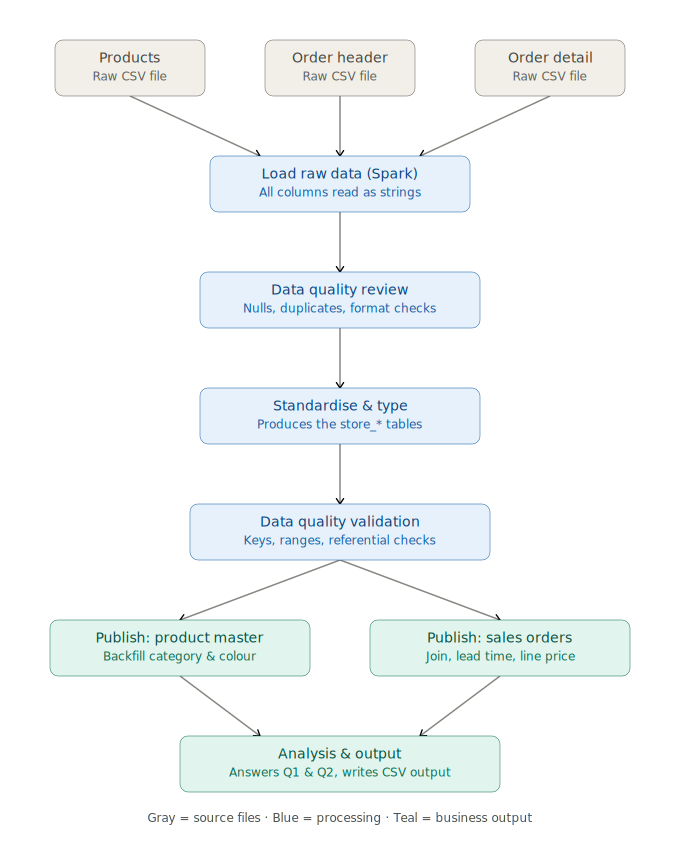

# Data Engineering Take-Home Assessment

**By::** Bukola Akinsola

## 📘 Start Here
This repository contains my solution to the data engineering take-home assessment: an end-to-end PySpark pipeline that ingests raw source data, reviews and standardises it, validates its quality, applies the required business transformations, and answers two analysis questions.

## Repository contents

| File | Purpose |
|---|---|
| `case_study_solution.ipynb` | The primary deliverable. A fully commented notebook walking through every step of the process which includes: data review, decisions, validation, transformations, and analysi. It also includes the reasoning behind each decision. **Start here for the detailed write-up.** |
| `case_study.py` | A runnable script version of the notebook. Produces the same store/publish tables and the same two analysis answers, without the exploratory commentary. Useful for running the pipeline end to end from the command line. |
| `images/workflow.svg` | A diagram of the pipeline's architecture/workflow (see below). |

The notebook is where the thinking lives: assumptions, findings, and the "why" behind each transformation. The script is the "just run it" version of that same logic.

## Architecture / workflow



The pipeline moves through six stages:

1. **Load raw data** — the three source CSVs (`products.csv`, `sales_order_header.csv`, `sales_order_detail.csv`) are read into Spark with every column typed as a string, so nothing is silently miscast before it's been reviewed.
2. **Data quality review** — the raw data is checked for NULLs, duplicate keys, invalid date/decimal formats, and stray whitespace, before anything is changed.
3. **Standardise & type** — issues found in step 2 are resolved (see findings below) and each column is cast to its proper type, producing the `store_product`, `store_sales_order_header`, and `store_sales_order_detail` tables.
4. **Data quality validation** — the store tables are re-checked: primary key uniqueness, referential integrity between fact and dimension tables, valid date logic (ShipDate ≥ OrderDate), numeric ranges, and a row-count reconciliation against the raw data.
5. **Publish layer** — the business transformations required by the assessment are applied, producing `publish_product` (product master) and `publish_orders` (sales orders with calculated fields).
6. **Analysis** — the two business questions are answered from the publish tables.

## Source data

| Table | Primary key | Foreign key(s) |
|---|---|---|
| Product | `ProductID` | — |
| SalesOrderHeader | `SalesOrderID` | — |
| SalesOrderDetail | `SalesOrderDetailID` | `SalesOrderID` → SalesOrderHeader, `ProductID` → Product |

## Data quality findings and decisions

These are the issues the review surfaced in the raw data, and how each was resolved in the standardisation step. Full detail and the supporting checks are in the notebook.

- **Duplicate `ProductID` records.** A small number of products appeared more than once. Review showed one record per `ProductID` was consistently more complete (populated `ProductCategoryName`/`ProductSubCategoryName`), so that record is kept and the rest are dropped.
- **Invalid `OrderDate` format.** A few `OrderDate` values were stored as `yyyy-MM` (e.g. `2021-06`) instead of `yyyy-MM-dd`. Since the day component is missing and can't be reliably inferred, these values are set to `NULL` rather than guessed.
- **Whitespace in unit-measure codes.** `SizeUnitMeasureCode` and `WeightUnitMeasureCode` had leading/trailing whitespace that could break grouping and comparisons. Trimmed.
- **Missing `ProductCategoryName`.** 144 records met the business rule criteria (a defined `ProductSubCategoryName` with no category) and were backfilled — `Clothing`, `Accessories`, or `Components` depending on subcategory. All 144 were successfully populated after the transformation.
- **Missing `Color`.** Defaulted to `"N/A"`.
- **Negative `OrderQty`.** Two records had an `OrderQty` of `-1`. This was flagged but not corrected — negative quantities can represent legitimate business events (e.g. returns/cancellations), so the records were kept as-is and documented rather than treated as an error.
- **Referential integrity.** No issues found — every `SalesOrderID` and `ProductID` referenced in `SalesOrderDetail` exists in its parent table.

## Publish-layer transformations

- **`publish_product`** — missing `Color` defaulted to `"N/A"`; missing `ProductCategoryName` backfilled from `ProductSubCategoryName` per the business rules above.
- **`publish_orders`** — `SalesOrderDetail` and `SalesOrderHeader` joined on `SalesOrderID`, with three calculated fields added:
  - `LeadTimeInBusinessDays` — weekday count between `OrderDate` and `ShipDate`.
  - `TotalLineExtendedPrice` — `OrderQty × (UnitPrice − UnitPriceDiscount)`.
  - `Freight` renamed to `TotalOrderFreight`.

## Analysis questions

1. **Which colour generated the highest revenue each year?** `publish_orders` is joined to `publish_product` on `ProductID`, revenue (`TotalLineExtendedPrice`) is summed by year and colour, and the top colour per year is ranked out.
2. **What is the average `LeadTimeInBusinessDays` by `ProductCategoryName`?** `publish_orders` is joined to `publish_product` on `ProductID`, and the average lead time is calculated per category (categories with no name are excluded).

Both answers are printed when `case_study.py` runs, and are shown with full working in `case_study_solution.ipynb`.

## Running the pipeline

**Requirements:**
- Python 3.9+
- Java 8 or 11 (required by Spark)
- PySpark (`pip install pyspark`)

**Steps:**
1. Clone the repo and place `products.csv`, `sales_order_header.csv`, and `sales_order_detail.csv` in a data folder.
2. Open `case_study.py` and update the `DATA_DIR`constant at the top of the file to point at your data folder.
3. Run:
   ```bash
   python case_study.py
   ```
4. The two analysis answers print to the console.
To follow the full reasoning behind each decision, open `case_study_solution.ipynb` in Jupyter.


---


## Project Structure

| File | Description |
| :--- | :---------- |
| **case_study_solution.ipynb** | Primary deliverable containing the complete assessment, documentation, validation, and analysis. |
| **case_study.py** | Standalone Python implementation of the same pipeline. |
| **data/** | Source datasets used throughout the assessment. |
| **README.md** | Project overview and implementation summary. |


---

